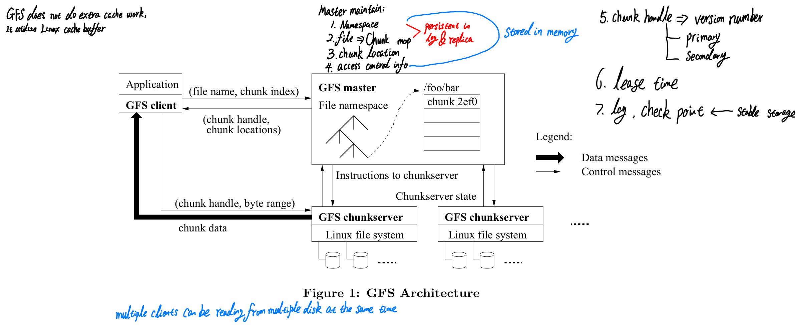
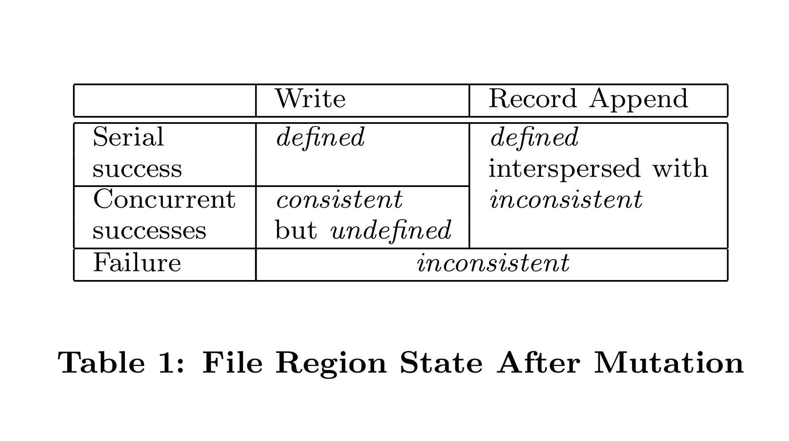
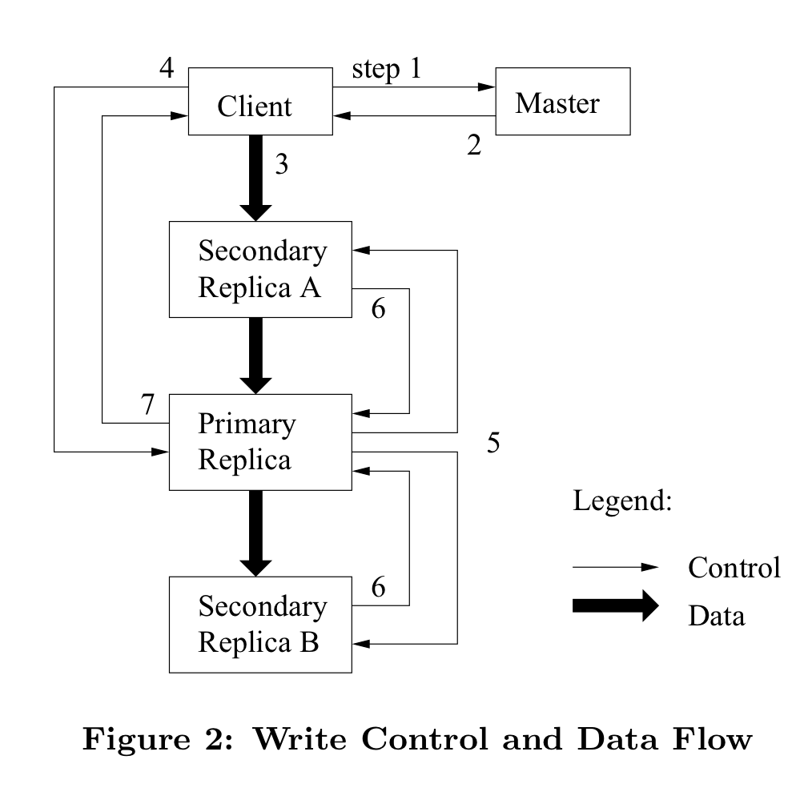

# [The Google File System](https://static.googleusercontent.com/media/research.google.com/en//archive/gfs-sosp2003.pdf)

## Brief Summary

The Google File System(GFS)  is a real world distribution file system example deployed in Google. It provide fault tolerance for supporting large-scale data processing workloads while running on inexpensive commodity hardware, and it delivers high aggregate performance to a large number of clients.

The Google File System deliver high aggregate throughput to many concurrent readers and writers performing a variety of tasks, achieving by separating file system control: 

- master for common operations and deliver chunk lease
- chuncksever for data transfer

It widely deployed within Google as the storage platform(It replaced by [**Colossus**](https://cloud.google.com/blog/products/storage-data-transfer/a-peek-behind-colossus-googles-file-system) and still using **Colossus** in 2024) for the generation and processing of data used by their service as well as research and development efforts that require large data set.

## What is the addressed problem and why is it important to address?

### Importance of Addressing the Problem:

For the practical perspective, Google need to distribution system to help them processing large-scale data set, like MapReduce module.

They need a file system with high availability, fault tolerant, data integration and also the data can be viewed globally.

### The problem need to address:

1. How to regard and handle the component failure?
2. How to store large file efficiently?
3. How to handle multiple clients append data to files efficiently?

## What has been done? what do previous studies fail to do and why?

This paper give some of difference assumptions for designing distribution file system compared with the previous work:

1. Component failure as the norm rather than the exception. The system is built from many inexpensive commodity components that often fail.
2. Expect Multi-GB files are the common case and should be managed efficiently.
3. The workload consist of two types of read:
   - Small random read
   - Large streaming read
4. The workload have many large, sequential writes that **append data to files**
5. The system must efficiently implement well-defined semantics for **multiple clients that concurrently append to the same file.**

**Compared with some of the previous work:**

- Unlike [AFS](https://dl.acm.org/doi/pdf/10.1145/35037.35059), GFS spreads a file's data across storage servers in a way that deliver aggregate performance and increase fault tolerance
- GFS dose not provide any caching below the file system interface, because GFS dose not require stream through large data set or randomly seek within it and read small amount s data each time.
- GFS use the centralized server approach in order to simplify the design, increase its reliability, and gain flexibility. 
  In particular, a centralized master make it much easier to implement sophisticated chunk placement and replication policies since the master already has most of the relevant information and control how it change.
- GFS use the commodity machines as chunk servers, instead of disk drivers.
- While using memory based queue, GFS use the atomic record to solve the similar problem related to the producer-consumer problem

## What is novelty or main contribution of this work?

In GFS, it introduce the architecture of **single master + chunk server + lease order**, which is a kind of novelty design at that time. The primary/secondary replication design is quite interesting as well.

GFS is a system applied in the Google's real production, which give us a good example of distribution file system in the real Google production

Unlike focus on large steaming insert and search and assume failure is a tricky case, GFS uses the commodity machine, mainly focus on large append write and assumes component failure is a common case.

## What is the technical method and approach of this work?

A GFS cluster consist of **a single master** and **multiple chunkservers** and is accessed by multiple **clients**. Each of component in the figure below is a typically a commodity Linux machine running a user-level server process.

- FIles are divided into fixed-size chunks, where each chunk is identified by an immutable and globally **unique 64 bit chunk handle** assigned by the master at the time of chunk creation.
- Chunkservers store chunk on local disks as Linux files and read/write chunk data specified by a chunk handle and byte range.
- Chunk size is 64 MB

- Master maintain all of the metadata, including:
  1. Namespace
  2. Access Control Information
  3. File => Chunk Map
  4. Chunk locations: monitor its status via HeartBeat messages
  5. Chunk handle => version number, primary/secondary
  6. Global wide chunk lease
  7. Operation Log
  8. Garbage collection of orphaned chunks
  9. Chunk migration between chunkservers

- Clients interact with **the master for metadata operations**, but **all data-bearing communication goes directly to the chunkservers**. Client never read/write file data through the master.
- Neither the client nor the chunkserver caches file data.

### Chunk

The default chunk size in GFS is **64 MB**. Each chunk replica is stored as a plain Linux file on a chunk server and is extended only as needed. ***Lazy space allocation*** avoids wasting space due to internal fragmentation.

For locations, the master does not keep a persistent record of which chunkservers have a replica of a given chunk. It simply polls chunkservers for that information at startup. The master can keep itself up-to-date thereafter because it controls all chunk placement and monitors chunkserver status with regular HeartBeat messages.

### Simple Read Flow

1. Client translate the file name and byte offset specified by the application into a chunk index within the file.
2. Client sends master a request containing:
   - File name
   - Chunk index
3. The master replies with the corresponding chunk handle and locations of the replicas.
4. The client caches this information using the file name and chunk index as the key.
5. The client sends a request to one of the replicas, most likely the closet one. The request specifies the chunk handle and  a byte range within that chunk.
6. Further reads of the same chunk require no more client-master interaction until the cache information expires or the file is reopened.
   **Client typically asks for multiple chunks in the same request** and the master can also include the information for chunks immediately following those requests. This extra information sidesteps several future client-master interactions at practically no extra cost.

### Data Mutations

File namespace mutations(*e.g.*, file creation) are atomic, where namepace locking guarantees atomicity and correctness.

A **file region is consistent** if all clients will always see the same data, regardless of which replicas they read from. **File region is defined** after a file data mutation if it is consistent and clients will see what the mutation writes in its entirely. When mutation succeeds with out interference from concurrent  writes, the affected region is defined: all clients will always see what the mutation has been written.

- Concurrent successful mutations leave the region undefined but consistent: all clients see the same data, but it may not reflect what any one mutation has written.
- A failed mutation makes the region inconsistent(hence undefined): different clients may see different data at different times.

In the paper, GFS has divide data mutation as two types:

1. Write data: data to be written at an application-specified file offset
2. Data append: data(the "record") to be appended ***atomically*** at least once even in the presence of concurrent mutations, but **at an offset of GFS's choosing**.
   Appending is far from efficient and more resilient to application failures than random writes.
   - One type of usage, a writer generates a file from beginning to end, where it atomically rename the file to a permanent name after writing all the data, or periodically checkpoints how much has been successfully written.
   - In the other typical usage, many writes concurrently append to a file for merged results or as a producer-consumer queue.
     - For reader, they can identify and discard extra padding and record fragments using the checksums.

The offset is returned to the client and marks the beginning of a defined region that contains the record.

For the scenario that multiple clients on different machines appends the same file concurrently, GFS serve as multiple-producer/single-consumer queues or contain merged result from many different clients. 
If  a record append fails at any replica, the client retries the operation. As a result, replicas of the same chunk may contain different data possibly including duplicates of the same record in whole or in part. This case is expected. **GFS only guarantees that the data is written at least once as an atomic unit.** The further data append will be assigned a higher offset or a different chunk even if a different replica later becomes the primary.

After a sequence of successful mutations, **the mutated files region is guaranteed to be defined and contain the data written by the last mutation**. GFS achieves this by:

1. applying mutations to a chunk in the same order **on all its replicas**
2. using **chunk version numbers** to detect any replica that has become stale because it has missed mutations while its chunkserver was down.
   Stale replica will never be involved in a mutation or given to clients asking the master for chunk locations.
   Since clients cache chunk locations, they may read from a stale replica before that information is refreshed, this will limited by:
   - cache entry's timeout
   - most of file are append-only, a stale replica usually returns a premature end of chunks rather than outdated data
3. GFS identifies component failures chunksevers by **regular handshakes between master and all chunksevers** and detects the data corruption by checksumming.
   Once problem surfaces, the data is restored from valid replicas as soon as possible.

#### Lease and Mutation Order

A mutation is an operation that changes the contents or metadata of a chunk such as a write or an append operations. Each mutation is performed at all the chunk's replicas.

GFS use ***lease*** to maintain a consistent mutation order across replicas. The master grants a chunk lease to one of the replicas, which call ***primary***.
The primary picks a serial order for all mutation to the chunk. All replicas follow this order when applying mutations. Thus, the global mutation order is defined first by the lease grant order chosen by the master, and within a lease by the serial numbers assigned by the primary.

As long as **the chunk is being mutated**, the primary can request and typically receive extension from the master indefinitely. These extension requests and grants are piggybacked on the HeartBeat messages regularly exchanged between the master and all chunkservers.

The master may sometimes try to revoke a lease before it expires, when master wants to disable mutations on a file that is being renamed.

#### Write Control Flow

1. **Client asks the master which chunkserver holds the current lease** for the chunk and the locations of the other replicas. 
   If no one has a lease, the master grants one to a replica it chooses.
   Raise version number from master, then store the version number on disk both master&chunkserver
2. **The master replies with the identity of the primary and the locations for the other(*secondary*) replicas.**
   The client caches this data for future mutations. It needs to contact the master only when the primary becomes unreachable or replies that it no longer holds a lease
3. The client **pushes data to all the replicas**, where the client can do it on any order.
   Each chunkserver will store the data in an internal LRU buffer cache until the data is used or aged out.
   By decoupling the data flow from control flow, we can improve performance by scheduling the expensive data flow based on the network topology regardless of which chunkserver is the primary.
4. Once all the replicas have acknowledged receiving the data, **the client sends a write request to the primary**.
   **The primary assigns consecutive serial numbers to all the mutations it receives**, possibly from multiple clients, which provides the necessary serialization. It applies the mutation to its own local state in serial number order.
5. **The primary forward the write request to all secondary replicas**. Each secondary replica applies mutations in the same serial number order assigned by the primary.
6. **The secondaries all reply to the primary** indicating that they have completed the operation.
7. **The primary replies to the client.** Any errors encountered at any of the replicas are reported to the client.
   In case of errors, the write may have succeeded at the primary and an arbitrary subset of the secondary replies. In that case, the client request is considered to have failed, and the modified region is left in an inconsistent state. Client will retrying the failed mutation by repeat the step from 3 to 7.

If a write by **the application is large or straddles a chunk boundary**, GFS client code break it down into multiple write operations.

When the primary checks to see if appending the record to the current chunk would **cause the chunk to exceed the maximum size(64 MB)**:

- If so, it pads the chunk to the maximum size, tells secondary to do the same and replies to the client indicating that the operation should be retried on the next chunk.
- If the record fits within the maximum size, the primary appends the data to its replica, tells the secondaries to write the data at the exact offset where it has, and finally replies success to the client.

#### Data flow transition

To utilize each machine's network bandwidth, the data is pushed linearly along a chain of chunkserver rather the distributed in some other topology.

To avoid network bottleneck and high-latency links, each machine forwards the data to the "closest" machine in the network topology that has not received it. And the chunkserver that received the data pushing from client forward it to the "closet" replica as well, repeating this step until all of the replica received the data.

To minimize latency by pipelining that data transfer over TCP connections. Once a chunkserver receives some data, it starts forwarding immediately.

## How is the work evaluated? Are the evaluation method concrete? Does the evaluation cover all the aspects of consideration? Do the evaluation results support the claims?

## What are impacts of this work?

